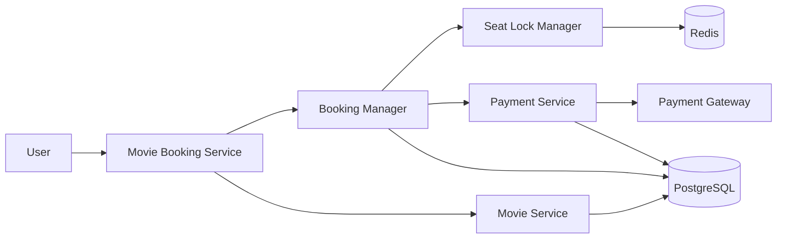

# 🎬 Event-Driven Concurrent Movie Reservation Engine

[](https://openjdk.org/)
[](#)
[](#)
[](#)

A high-performance, low-level design (LLD) implementation of a scalable ticket reservation system capable of handling catastrophic traffic surges (e.g., millions of concurrent clicks during blockbuster drops). Built with strict object-oriented paradigms, thread safety, decoupling boundaries, and state isolation.

---
## High Level Architecture



## 📌 Architectural Blueprint LLD

The core domain relies on an explicit separation of concerns. While read-heavy operations handle catalog exploration, the write-heavy reservation engine isolates state modification through dedicated transaction boundaries.

```mermaid
classDiagram
    direction TB

    %% --- Classes and Entities ---
    class User {
        -id: String
        -name: String
        -email: String
    }

    class Booking {
        -id: String
        -user: User
        -show: Show
        -seats: List~Seat~
        -totalAmount: double
        -payment: Payment
        +confirmBooking()
    }

    class BookingManager {
        +lockSeats()
        +processPayment()
        +confirmBooking()
    }

    class Movie {
        -id: String
        -title: String
        -durationInMinutes: int
    }

    class Show {
        -id: String
        -movie: Movie
        -screen: Screen
        -startTime: LocalDateTime
        -pricingStrategy: PricingStrategy
    }

    class Seat {
        -id: String
        -row: int
        -col: int
        -type: SeatType
        -status: SeatStatus
    }

    class SeatLockManager {
        +lockSeats()
        +unlockSeats()
    }

    class MovieBookingService {
        +findShows()
        +bookTickets()
    }

    class Cinema {
        -id: String
        -name: String
        -city: City
    }

    class Payment {
        -id: String
        -amount: double
        -status: PaymentStatus
        -transactionId: String
    }

    %% --- Relationships & Multiplicities ---
    Booking "n" --> "1" User : Association
    Booking "n" --> "1" Show : Association
    
    Movie "1" <-- "1..*" Show : Association
    Cinema "1..*" --> "1" Movie : For
    Cinema "1" ..> Payment : Dependency
    
    Show "1" --> "1" Seat : 1 contains
    Show "1..*" --> "1" Payment : Association

    %% --- Service Managers Connections ---
    BookingManager ..> Booking : Manages
    BookingManager ..> SeatLockManager : Dependency
    SeatLockManager ..> Seat : Dependency
    SeatLockManager ..> MovieBookingService : Dependency
    MovieBookingService ..> Show : Manages